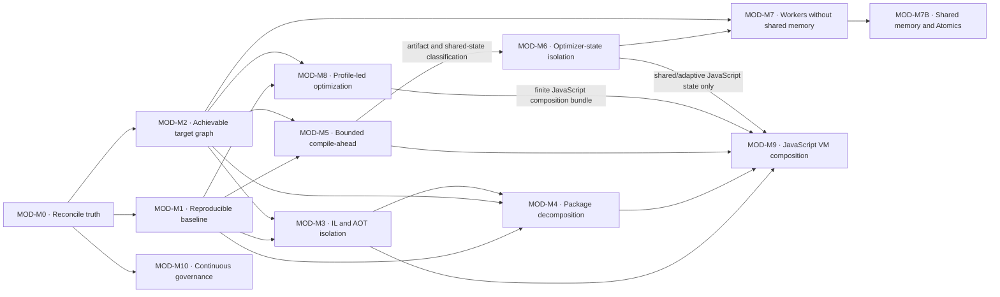

# Broiler.JS performance, architecture, and concurrency modernization roadmap

Turn the roadmap audit into an executable program: first make the current state and
measurement system trustworthy, then establish enforceable assembly and AOT boundaries,
then add bounded concurrency and profile-led engine work, and only then select how much of
the JavaScript built-in's source compiler belongs in each Broiler.VM composition.

> This is the **cross-track orchestration authority**. It supersedes conflicting umbrella
> sequencing or dependency text in [`Roadmap.md`](Roadmap.md), but does not replace the
> detailed scope and evidence owned by [`Assemblies.md`](Assemblies.md),
> [`Component.md`](Component.md), phases 0–9, and their status records. It owns ordering,
> dependencies, decision points, and program-level exit gates. Mutable results remain in
> the owning `*.status.md` record and in reproducible machine-generated evidence.

> **Current reconciliation note (2026-08-22).** The ExpressionCompiler model/emitter project
> split has landed but still has validation work open. The aggregate repository has also
> implemented bounded script compile-ahead and a first Worker slice. This review now indexes
> and classifies those facts in the owning plan/status records as implemented subsets, not as
> proof that MOD-M5, MOD-M6, or MOD-M7 is accepted: optimizer-state ownership, shared/unshared
> cache stress, lifecycle coverage, resource caps, and memory-plateau gates remain open.

---

## 1. Mandate

This roadmap has six outcomes:

1. contributors can identify the engine's real current state from one generated index;
2. performance claims are reproducible against a same-machine, known-good control;
3. the target assembly graph is buildable, acyclic, baselinable, and compatible;
4. the IL and Native AOT compositions are enforced by builds rather than prose labels;
5. independent JavaScript work can scale without executing one `JSContext` concurrently;
6. optimization, Workers, shared memory, and optional JavaScript runtime-compiler/adaptive
   work proceed only after their entry measurements justify them; Broiler.VM core and the
   WebAssembly built-in retain their own gates.

The roadmap deliberately combines performance, decomposition, and concurrency. In this
engine they share the same prerequisites: a backend-neutral semantic front end, explicit
state ownership, reproducible package and memory baselines, and architecture tests that
prevent dynamic-code dependencies from leaking back into NativeAOT compositions.

### Relationship to the existing plans

| Existing source | Continues to own |
|---|---|
| [`Measurement.md`](Measurement.md) | the acceptance protocol and the conditions under which a performance result may be claimed |
| [`Roadmap.md`](Roadmap.md) and [`Roadmap.status.md`](Roadmap.status.md) | the historical optimization catalogue, IL campaign crosswalk, and cross-phase performance evidence; this roadmap owns conflicting modernization sequencing |
| [`Phase-0.md`](Phase-0.md) through [`Phase-5.md`](Phase-5.md) | detailed work on the current IL execution path |
| [`Assemblies.md`](Assemblies.md), [`AssemblySplit.md`](AssemblySplit.md), and their status records | assembly moves, backend isolation, and the evidence for each graph change |
| [`Phase-6.md`](Phase-6.md) through [`Phase-9.md`](Phase-9.md) | the JavaScript built-in profile on Broiler.VM: JavaScript lowering/correctness, shippability, profile-led optimization, and optional JavaScript-to-IL adaptivity. Broiler.VM core and the WebAssembly built-in are owned by `Broiler.VM/docs/roadmap.md` in the aggregate repository |
| [`Component.md`](Component.md) | conformance, host modes, public API, and package readiness; it links the JavaScript concurrency plan into the component roadmap |
| [`Concurrency.md`](Concurrency.md) and [`Concurrency.status.md`](Concurrency.status.md) | JavaScript-local compile-ahead, independent-context safety, Worker implementation, and their mutable evidence |
| [`ModernizationDelivery.md`](ModernizationDelivery.md) | the subordinate delivery-wave and handoff view requested by this review; it creates no independent state or sequencing authority |
| Aggregate `docs/architecture/multithreading.md` | integration across HTML, loading, scheduling, and other components; JavaScript implementation details and acceptance remain in the component-owned concurrency pair |

The `MOD-M*` identifiers below do not renumber any existing item and deliberately avoid the
legacy validation IDs such as `M6` and `M7` used by architecture tests. Each work package must
name its owning plan/status record before implementation starts. If none exists, the first
change creates or nominates that evidence record; this overlay is never used as a delivery
journal.

### Evidence routing

MOD-M0-1 defines one machine-readable modernization-state source at
`eng/performance/roadmap-items.json`. A state transition and its owning status evidence land
in the same change; the human-readable cross-track index is generated from that file and is
never edited as a second ledger. `eng/performance/ownership.json` remains the semantic test
and benchmark-owner mapping unless MOD-M0-1 deliberately generates it from the same source;
the two files may not carry conflicting accountable owners. Required evidence routes are:

| Modernization work | Exact owning record |
|---|---|
| MOD-M0 split validation and compatibility | [`AssemblySplit.status.md`](AssemblySplit.status.md) |
| MOD-M0 graph and MOD-M2–MOD-M4 architecture/package work | [`Assemblies.status.md`](Assemblies.status.md), or a new dedicated split plan/status pair named before that split starts |
| MOD-M0 phase reconciliation and MOD-M8 optimization | the matching phase 0–5 plan/status pair and the VM status records when their state is affected |
| MOD-M1 baseline and MOD-M10 governance | [`Roadmap.status.md`](Roadmap.status.md) plus the immutable raw evidence bundle |
| MOD-M5–MOD-M7 concurrency and Workers | [`Concurrency.md`](Concurrency.md) and [`Concurrency.status.md`](Concurrency.status.md); aggregate implementation evidence is imported and classified there |
| MOD-M9 JavaScript composition decision and its implementation | [`Phase-6.status.md`](Phase-6.status.md), then the matching phase 7–9 status record; generic VM/WebAssembly evidence stays with Broiler.VM |

## 2. Program rules

### State model

Use the same state vocabulary everywhere:

`proposed → implemented → validated → accepted`

- **Proposed** means the hypothesis, owner, next action, and gate exist.
- **Implemented** means the code or document change landed; its exit gate may still be open.
- **Validated** means the semantic, architecture, compatibility, and measurement evidence
  required by the item exists and is reproducible.
- **Accepted** means the owning item's objective exit gate passed. A performance or resource
  claim additionally passes [`Measurement.md`](Measurement.md) on the declared profiles.
- **Blocked** is non-terminal: the index names the unmet dependency and the event that makes
  the item actionable again.
- **Deferred** and **cancelled** are explicit terminal decisions. They are preferable to an
  indefinitely open speculative item.

An implemented item is not automatically validated, and a validated microbenchmark result
is not automatically an accepted engine-level claim.

### Required fields for every work package

Before work starts, record:

- one accountable maintainer and the owning assemblies or tooling area;
- the architectural requirement or measurable hypothesis;
- current evidence and the exact next action;
- the control arm and feature-disable or rollback path;
- the semantic, compatibility, and resource guardrails;
- the corpus, RID, CPU-feature, GC, and publish profiles that apply;
- the evidence destination and objective exit gate; and
- the decision that follows a pass, a failure, or a result below measurement resolution.

The tables below name an **owner area**. Scheduling an item requires replacing that area
with an accountable maintainer in the generated item index.

### Non-negotiable engineering invariants

1. **At most one executing thread per context.** Parallelism is across independent contexts
   or compile units, never simultaneous execution inside one `JSContext`. A general context
   may migrate only at a quiescent boundary; a Worker agent keeps its fixed owner thread.
2. **Semantics precede speed.** Any unexplained conformance, exception-order, observable
   initialization, or API difference is a regression regardless of throughput.
3. **The semantic front end is shared.** Parsing, early errors, binding, hoisting, scope,
   free-name analysis, and backend-neutral lowering are not duplicated between IL and
   bytecode.
4. **Dynamic code is an explicit composition boundary.** A Broiler.VM language profile is
   not a deployment composition. Only a JavaScript composition that includes the IL back end
   may transitively reach `System.Reflection.Emit`; NativeAOT compositions cannot discover
   profiles or back ends by assembly/type name.
5. **Sequential execution remains available.** Concurrency and tiering have a deterministic
   single-threaded control and a fast disable path.
6. **Resource use is part of performance.** Time is reported with allocation, GC, working
   set, committed/virtual memory, threads, code/package size, and tail latency as applicable.
7. **Package moves preserve consumers deliberately.** Namespace preservation alone is not
   binary compatibility; assembly identity, type forwarding, package contents, and pristine
   consumers are gated.
8. **Plans do not copy volatile facts.** Plans name the command or evidence record that
   reads a count, graph, commit, test result, or benchmark score.

## 3. Dependency map

MOD-M1 and MOD-M2 are the first parallel work streams. MOD-M4 discovery spikes may overlap MOD-M3, but a
production move that changes the IL/AOT closure waits for the applicable MOD-M3 gate. MOD-M6 depends
on MOD-M5's artifact/shared-state classification, not on background compilation being a
performance success. MOD-M8 is continuous, so MOD-M9 waits only for a predeclared finite evidence
bundle covering front-end/startup, compile-ahead, package/AOT, and current-backend results;
each item in that bundle must be accepted, deferred, cancelled, or below resolution. MOD-M10
begins with MOD-M0 and remains active throughout.

### Portfolio overview

| Phase | Outcome | Relative size | Primary owner area |
|---|---|---:|---|
| **MOD-M0** | documentation, state, and landed-split truth agree | M | roadmap maintainers, Compiler, packaging |
| **MOD-M1** | stable, comparative, durable performance baselines | L | performance harness and CI |
| **MOD-M2** | an acyclic backend-neutral target graph | L | architecture, Parser, Compiler, Runtime |
| **MOD-M3** | enforceable IL/reflection/AOT boundaries | L–XL | Compiler backends, packaging, AOT |
| **MOD-M4** | smaller packages with measured deployment value | L–XL, divisible | Hosting, BuiltIns, packaging |
| **MOD-M5** | a measured decision on bounded background compilation | M–L | Compiler, Engine, embedding |
| **MOD-M6** | safe independent-context scaling and reclaimable feedback | L | Runtime, Engine, code cache |
| **MOD-M7/MOD-M7B** | Workers first; correct shared memory only as a later capability | XL, staged | Engine, Runtime, host integration |
| **MOD-M8** | current IL engine optimized from profiles, not catalogue labels | continuous S–L items | owning phase/assembly |
| **MOD-M9** | JavaScript built-in selects execution-only or runtime-compiler depth explicitly | S–M decision; XL implementation | FrontEnd, Broiler.VM JavaScript profile, product owner |
| **MOD-M10** | drift detected automatically | S initially, continuous | docs, CI, release engineering |

---

## MOD-M0 — Establish one trustworthy current state

**Objective.** Reconcile the landed code, validation state, documented graph, open-item
inventory, and reproduction commands before using any plan as an implementation brief.

**Entry check.** Read [`AssemblySplit.status.md`](AssemblySplit.status.md), the generated
project graph, and the consumer/API baseline. MOD-M0 responds to whatever validation work those
sources show; their mutable state is not copied into this plan.

| ID | Work package and next action | Owner area | Size | Evidence target |
|---|---|---|---:|---|
| **MOD-M0-1** | Adopt the state model and create `eng/performance/roadmap-items.json` as the single machine-readable modernization source for accountable owner, state, blocker, next action, plan, and evidence links. Either generate `ownership.json` from it or define the latter as a separate semantic-owner mapping with referential-integrity checks. Generate the compact index rather than editing a second ledger. | roadmap tooling | S | [`Roadmap.status.md`](Roadmap.status.md) plus generated data |
| **MOD-M0-2** | Regenerate the current project graph and assembly census from `.csproj` and source inputs; replace every stale “today” description with the generated view or a link to it. | architecture/tooling | S | [`Assemblies.status.md`](Assemblies.status.md) |
| **MOD-M0-3** | Run the split's S-7 conformance comparison manifest by manifest and classify every delta. The split remains `implemented, validation pending` until the comparison has a terminal result. | Compiler/conformance | M | [`AssemblySplit.status.md`](AssemblySplit.status.md) |
| **MOD-M0-4** | Add packaged source-consumer, previously compiled binary-consumer, public-API diff, package-content, and assembly-identity checks for the split. Decide explicitly whether type forwarding or a major-version break is required. | packaging/API | M | [`AssemblySplit.status.md`](AssemblySplit.status.md), [public API](../public-api.md) |
| **MOD-M0-5** | Reconcile Phase 0 through Phase 9, assembly, and concurrency next actions with their status records; repair drifting item IDs and distinguish actionable, queued, gated, implemented-subset, deferred, and accepted work. Correct stale hardware, polymorphic-cache, SIMD, compile-ahead, and Worker labels here. | roadmap maintainers | S | the owning phase, assembly, and concurrency status records |
| **MOD-M0-6** | Fix reproduction paths, case-sensitive links, anchors, duplicated acceptance text, and ownership entries; add repository-wide Markdown link/anchor/case, duplicate item-ID, and stale-state checks to CI. | docs/CI | S–M | [`Roadmap.status.md`](Roadmap.status.md) |
| **MOD-M0-7** | Keep [`Concurrency.md`](Concurrency.md) / [`Concurrency.status.md`](Concurrency.status.md) indexed and cross-linked with [`Component.md`](Component.md) and the aggregate multithreading plan. Maintain JavaScript-local implementation and acceptance there, retain only cross-component integration dependencies at repository root, and mechanically check that the ownership boundary does not drift. | JS and aggregate roadmap owners | S | concurrency pair, [`Component.md`](Component.md), aggregate multithreading plan |
| **MOD-M0-8** | Immediately investigate the suspected `TypedArray.prototype.set` overlap/offset wrong-answer case: add the focused regression first and fix correctness if reproduced. This does not wait for MOD-M1; MOD-M8-5 owns only the optional bulk-copy performance follow-up. | BuiltIns/conformance | S | [`Component.md`](Component.md) and focused regression |

### MOD-M0 exit gate

- The generated project graph and the architecture/reference documents agree.
- S-7 has exact manifest-by-manifest equivalence with the pre-split baseline. Any intentional
  semantic fix is peeled into a separate change with its own gate; it is not absorbed into
  the assembly move's baseline.
- Public API, package contents, and representative source and binary consumers have a
  reproducible baseline.
- No document calls a landed project split “not started,” and no plan prescribes a next
  action already completed in its status record.
- Aggregate compile-ahead and Worker evidence is mapped to the MOD-M5–MOD-M7 gates as an implemented
  subset, validated subset, accepted item, or explicit open gap; “built” is not used as a
  synonym for all lifecycle, ownership, and resource gates passing.
- Repository-wide Markdown link, anchor, filename-case, duplicate item-ID, and item-state
  checks pass on a case-sensitive CI filesystem.
- One index answers what is proposed, implemented, validated, accepted, blocked, deferred,
  or cancelled without reading the entire campaign history.

**Stop rule.** Do not start structural moves while the current graph or validation state is
disputed. An unexplained conformance or consumer delta blocks acceptance; it does not erase
the fact that the implementation landed.

---

## MOD-M1 — Make the performance baseline decision-grade

**Objective.** Turn the existing measurement protocol into a stable-hardware, same-machine
regression system that can reject real regressions and declare small effects unresolved.

**Depends on:** MOD-M0.

| ID | Work package and next action | Owner area | Size | Evidence target |
|---|---|---|---:|---|
| **MOD-M1-1** | Separate PR smoke from acceptance. Smoke proves wiring only; stable controlled hardware is the sole source of accepted performance claims. | CI/performance | S | [`Measurement.md`](Measurement.md) |
| **MOD-M1-2** | Provision declared acceptance lanes for Windows x64, Linux x64, and Linux Arm64. Record CPU, microcode, power/governor state, thermals, memory, OS, SDK, runtime, bootstrap profile, and publish settings. Have each measured child attest effective GC, tiering/PGO, ReadyToRun, CPU-intrinsic, and other relevant runtime state; requested and effective values must agree. | CI/release | L | performance run manifest |
| **MOD-M1-3** | Execute, rather than merely list, applicable CPU-feature and GC arms: x64 feature on/off, AdvSimd-capable Arm64, workstation GC, and server GC. Expand the declared matrix into jobs and fail any arm that cannot prove its effective configuration. A claim is scoped only to arms actually run. | performance harness | M | raw run bundle |
| **MOD-M1-4** | Replace the current first-two-repetition/intersection comparator with a retained known-good candidate/control comparison. Consume every configured repetition, require exact row-set and compatible-manifest equality, compare time plus declared allocation/resource guardrails, and detect deliberately seeded timing and allocation regressions. | harness/CI | M | comparison report and comparator tests |
| **MOD-M1-5** | Calibrate lane × workload × metric A/A stability envelopes independently of candidate decisions. A failed A/A envelope invalidates the run; it does not silently widen the candidate threshold. Recalibration is a separate control-only baseline change with its own evidence. | harness/CI | S–M | calibration report |
| **MOD-M1-6** | Run a JetStream 3 applicability spike and check in a compatible-test/exclusion manifest separating shell-compatible, browser-host, and Wasm-dependent cases. Add the supported subset, script-heavy cold startup/first-script/first-paint fixtures, independent-context scaling, and focused engine probes. Keep Octane as historical continuity, not the sole priority signal. | benchmarks/embedding | L | [`Roadmap.status.md`](Roadmap.status.md) and raw artifacts |
| **MOD-M1-7** | Capture process-wide allocation, RSS/working set, committed/virtual memory, GC pauses/collections, thread count, queue depth, and p50/p95/p99 where background work is involved. Retain thread-local allocation probes for single-thread microbenchmarks only. Run EventPipe/profilers as separate matched diagnostic arms, measure their observer effect, and never use an instrumented arm as the primary timing result. | diagnostics | M | EventPipe/runtime-counter bundle |
| **MOD-M1-8** | Version assembly and package baselines: direct/transitive edges, file and IL/metadata bytes, public types, package contents, publish bytes, loaded assemblies, cold context time, and working set. | packaging/performance | M | generated assembly metrics |
| **MOD-M1-9** | Store schema-versioned, checksummed, immutable summaries and raw BenchmarkDotNet, EventPipe, build, publish, and conformance artifacts for every supported release and, prospectively, at least the two previous accepted baselines. Record candidate/control commits, recursive submodule revisions, clean-tree proof or retained patch/untracked manifest, resolved dependency graph, SDK/runtime, generated-source hashes, and immutable corpus/harness revisions. Bootstrap by rerunning two nominated compatible historical revisions on controlled lanes; short-lived CI artifacts are a cache, not the evidence store. | release engineering | M | durable artifact and build-identity index |
| **MOD-M1-10** | Define the candidate decision before a run: primary metric and direction, minimum relevant effect or equivalence budget, paired analysis method, guardrail precedence, missing-row failure, and confirmation rerun. Treat the noise band as lane stability, not the regression threshold. | performance owners | S–M | [`Measurement.md`](Measurement.md), comparison schema |
| **MOD-M1-11** | Resolve every comparison request through the semantic-owner mapping. Run the owning focused tests and applicable pinned test262 manifests on candidate and control, and attach them to the same immutable decision bundle. A baseline-profile job cannot publish an accepted result without these semantic gates. | performance/conformance | M | ownership mapping and decision bundle |

### Required measurement arms

| Question | Minimum control arms | Primary measures | Guardrails |
|---|---|---|---|
| single-thread optimization | either one binary with a proven no-overhead off/on switch, or isolated candidate/control builds in balanced ABBA/BABA process order with a shared null control | wall time, throughput, allocation | conformance, GC, code/package size, control identity |
| cold startup or packaging | clean process, identical publish inputs | first-context/first-script, publish bytes, loaded files | working set, missing globals/features |
| background compile | background off, then 1, 2, 4, automatic worker budgets | critical-path time, queue/compile overlap, p50/p95/p99 | RSS, virtual memory, workers, GC, error order |
| independent contexts | 1, 2, 4 contexts and a serialized control | throughput and tail latency | wrong answers, cross-realm state, memory plateau |
| SIMD/intrinsics | x64 feature on/off and supported Arm64 | hot-loop throughput | fallback semantics, code size, startup |
| package split | monolith and each satellite composition | package/publish size, cold load, working set | public API, bootstrap surface, conformance |

Whenever a gate requires a **memory plateau**, its protocol is fixed before the candidate
run: warm-up point, number and size of rounds, idle/post-GC sampling procedure, allowed live
cache, and control-arm slope band. Passing means retained-live growth after warm-up stays
inside that band with no unexplained positive trend.

### MOD-M1 exit gate

- Independent A/A calibration sessions on every claimed lane satisfy the predeclared
  lane × workload × metric stability envelopes, with cold and warm results separate.
- The fail-closed comparator consumes every configured repetition, rejects absent/extra or
  incompatible rows and manifests, and detects intentionally seeded timing and allocation
  regressions.
- The predeclared paired decision rule evaluates a practical effect/equivalence threshold
  independently of A/A stability and produces the expected `accept`, `reject`, `equivalent`,
  `below-resolution`, or `invalid-run` result; a provisionally qualifying change requires a
  fresh confirmation session before acceptance.
- Every measured child proves the effective CPU features, GC, tiering/PGO, ReadyToRun,
  bootstrap profile, corpus, repetitions, and publish properties that the run requested.
- Candidate and control have reproducible build identities and the same decision bundle
  contains the owning focused tests and applicable pinned test262 results.
- Checksummed raw evidence covers every supported release and the available nominated
  historical baselines; the policy retains the two previous accepted baselines once they
  exist, and every published summary can be regenerated from raw evidence.
- Phase 0's outstanding baseline work can close without weakening
  [`Measurement.md`](Measurement.md).

**Stop rule.** If A/A controls fail their stability envelope, invalidate the session. If the
paired interval cannot resolve the predeclared practical threshold, record the candidate as
below resolution. Stabilize the lane, increase samples, or narrow the workload; never turn
lane instability into a wider post-hoc acceptance threshold.

---

## MOD-M2 — Prove an achievable assembly and semantic-front-end graph

**Objective.** Replace an aspirational assembly count with an acyclic graph and prove, with
project shells and a minimal backend test sink, that a shared semantic-front-end boundary is
feasible. Production JavaScript-profile lowering remains behind MOD-M9's composition and
capability decision; generic Broiler.VM core and WebAssembly-profile work do not.

**Depends on:** MOD-M0. May run alongside MOD-M1.

The `.csproj` graph is authoritative, as described by the
[dependency rules](../architecture/dependencies.md). In particular, do not merge
Storage with the expression foundation while Storage reaches Ast, and do not merge Runtime
with Engine while Parser and Engine create a return edge. A lower assembly count is not a
success if it introduces cycles or hides useful ownership boundaries.

| ID | Work package and next action | Owner area | Size | Evidence target |
|---|---|---|---:|---|
| **MOD-M2-1** | Generate current and proposed `ProjectReference` graphs, including transitive closure, target composition, public types, package identity, and forbidden edges. | architecture/tooling | S–M | [`Assemblies.status.md`](Assemblies.status.md) |
| **MOD-M2-2** | Re-open A-0 as a real build spike: create target project shells, move no production code, and prove the graph restores and compiles before approving names or merges. | architecture | M | [`Assemblies.status.md`](Assemblies.status.md) |
| **MOD-M2-3** | Resolve the foundation cycle by preserving Expressions as a bottom model assembly or extracting a smaller Primitives/Model contract. Remove Storage's Ast dependency before considering a fold. | Storage/Ast/Expressions | M | [`Assemblies.status.md`](Assemblies.status.md) and graph ADR |
| **MOD-M2-4** | Inventory Parser→Runtime type use. Remove or invert the edge if feasible; otherwise preserve the boundary and revise the proposed tiers. Keep Runtime and Engine separate unless an independently measured deployment or startup result justifies a later merge. | Parser/Runtime/Engine | M | [`Assemblies.status.md`](Assemblies.status.md) and graph ADR |
| **MOD-M2-5** | Specify a backend-neutral `FrontEnd`/`Semantics` boundary for early errors, binding, scopes, hoisting, free-name and numeric-local analysis, and shared lowering. Prove the shape with project shells and a minimal fake/test backend; produce a priced extraction plan without migrating production bytecode. | Parser/Compiler | M–L | build spike, semantic fixtures |
| **MOD-M2-6** | Prove the LinqExpressions registration/compilation cut with a project-shell or file/type dependency spike. MOD-M3-3 owns the production move. | LinqExpressions/IL | S–M | graph and build evidence |
| **MOD-M2-7** | Design the backend contract against IL and the minimal test sink without exposing `DynamicMethod`, reflection-emitter, or realm-captured assumptions. Specify cache-key inputs; production bytecode adoption remains conditional on MOD-M9. | Compiler backends/Runtime | M | contract tests |
| **MOD-M2-8** | Create a project/assembly/package/namespace identity matrix, including intentional spelling repairs and type-forwarding decisions. | packaging/API | M | compatibility baseline |
| **MOD-M2-9** | Add architecture tests for acyclicity, tier direction, optional satellites, bytecode→IL prohibition, the one allowed Emit owner, public API, and assembly budgets. | architecture/CI | M | CI architecture suite |

### Recommended target boundaries

These are hypotheses to prove in MOD-M2, not pre-approved names:

| Boundary | Responsibility | Reason to keep or introduce it |
|---|---|---|
| **Primitives/Expressions model** | expression nodes and the smallest shared contracts | true bottom layer for Ast, Storage, Parser, Runtime, and both backends |
| **Ast** | syntax tree and syntax-only helpers | avoids pulling storage or runtime into parsing |
| **Parser** | text-to-Ast and syntax diagnostics | separately baselinable front-end cost |
| **Storage** | property-name and storage mechanics above the shared model | remains separate until its Ast edge is removed or isolated |
| **FrontEnd/Semantics** | binding, scope, hoisting, early errors, shared analyses and lowered IR | gives an approved VM one semantics source without beginning VM work in MOD-M2 |
| **Runtime** | values, objects, shapes, caches, job/runtime contracts | clearer state ownership and independent-context baseline |
| **Engine** | contexts, realms, bootstrap, execution coordination | keeps embedding/lifecycle separate from the object model |
| **BuiltIns and satellites** | core ECMAScript built-ins plus independently optional Temporal, Intl, and RegExp candidates | makes optional deployment cost measurable without changing core semantics |
| **IL** | IL lowering/emission, IL adapter, assembly code cache, and ILPack | one enforceable dynamic-code boundary |
| **Bytecode and Bytecode.Compiler** | interpreter/runtime and, only after MOD-M9, compiler lowering | mutually optional with IL and forbidden from depending on it |
| **Hosting abstractions** | context/bootstrap interfaces and backend-neutral composition hooks | usable without CLI, Roslyn, NuGet, or hard IL references |
| **CLI/composition** | command line, CSX/NuGet tooling, default backend selection | intentionally feature-rich and not an AOT foundation |
| **Composition profiles** | full IL, bytecode/AOT, and optional-feature meta-packages | make the supported transitive closures explicit and build-tested |

### MOD-M2 exit gate

- Proposed project shells compile as an acyclic graph and match the checked-in generated
  target graph.
- An IL adapter and minimal backend test sink compile against the proposed neutral contract;
  project-shell architecture tests prove that a future bytecode compiler need not reference
  IL. No production portable compiler migration is required before MOD-M9.
- Architecture tests enforce every allowed and forbidden edge.
- Every project, assembly, package, namespace, and public-type move has a compatibility
  disposition.
- An ADR records which folds were accepted, rejected, or deferred and why.

**Stop rule.** Reject a merge that creates a cycle or lacks a deployment, AOT, ownership,
or measurable baselining benefit. Prefer a folder/namespace boundary when a new assembly
would add packaging complexity without enforcing a useful contract.

---

## MOD-M3 — Isolate dynamic code and make Native AOT a publish-and-run property

**Objective.** Define the complete IL/reflection boundary, eliminate magic-name backend
discovery from NativeAOT compositions, and prove supported Native AOT capability by executing a
published application.

**Depends on:** MOD-M1 and MOD-M2. Crosswalk: A-3, A-4, A-6, and A-8. MOD-M3-5 is preliminary
evidence for A-7 and cannot close A-7's representative-script capability gate.

| ID | Work package and next action | Owner area | Size | Evidence target |
|---|---|---|---:|---|
| **MOD-M3-0** | Before publishing, declare the preliminary AOT graph-gate RID matrix from supported Native AOT targets and product needs. A later result may narrow support explicitly, but the candidate cannot choose its RIDs after the run. | product/AOT/CI | S | [`Assemblies.status.md`](Assemblies.status.md) |
| **MOD-M3-1** | Generate a full census of `Reflection.Emit`, `RequiresDynamicCode`, `RequiresUnreferencedCode`, `Assembly.Load`, assembly-qualified `Type.GetType`, generated/module registration, and equivalent discovery. Classify every site by target composition. | AOT/tooling | M | [`Assemblies.status.md`](Assemblies.status.md) |
| **MOD-M3-2** | Replace backend and module discovery by string with explicit or generated registration. Keep intentional CLR reflection in an explicitly excluded satellite with reviewed annotations. | Engine/Expressions/Modules | M–L | architecture tests |
| **MOD-M3-3** | Form the real IL boundary: emitter-specific Compiler code, Linq adapter, `AssemblyCodeCache`, and ILPack all belong below the IL composition. Correct any claim that the front-end split already isolated every Emit use. | IL/CLI packaging | L | [`Assemblies.status.md`](Assemblies.status.md) |
| **MOD-M3-4** | Assign and resolve every trim/AOT warning. Portable publish output must have zero trim/AOT warnings; any analyzer suppression is separately inventoried with owner, rationale, and reachability proof. | AOT owners | M | analyzer and publish logs |
| **MOD-M3-5** | Publish and run the current portable numeric sample on every MOD-M3-0 AOT RID with warnings treated as errors. Label this an **execution-only portable-island gate**: it proves the checked-in numeric bytecode runtime closure, not the Parser/bytecode-compiler/Runtime/BuiltIns graph and not full JavaScript Native AOT support. | AOT/CI | M | publish-and-run bundle |
| **MOD-M3-6** | Add closure tests that fail if NativeAOT compositions transitively reach IL, Roslyn, NuGet scripting, ILPack, unapproved reflection, or name-based backend/profile loading. | architecture/CI | S–M | CI architecture suite |

### MOD-M3 exit gate

- The dynamic-code/reflection inventory is generated, composition-classified, and has no
  unowned sites.
- Only shipped/runtime assemblies in the IL boundary reference `System.Reflection.Emit`;
  explicitly allowlisted test/build tools are reported separately.
- Portable deployment compositions contain no magic-name backend/module discovery.
- The current supported portable sample publishes **and runs** on every MOD-M3-0 RID with
  zero trim/AOT warnings, and every analyzer suppression is inventoried and justified.
- CI verifies the transitive closure, analyzer results, publish result, and runtime result.
- Documentation describes the exact current subset; analyzer cleanliness is never called a
  full JavaScript engine capability.

The composition selected by MOD-M9 adds the distinct JavaScript deployment closure and
representative script/host surface named by its capability manifest. A general runtime-compiler
composition also satisfies A-7's general-engine intent. That JavaScript-profile work is owned by
MOD-M9/Phase 6, not by MOD-M3's numeric-seed exit gate or by Broiler.VM core.

**Stop rule.** If a supported semantic feature requires unavoidable reflection, narrow and
document the Native AOT composition or move the feature to an excluded satellite. Do not silence a
warning or add an AOT checkmark in lieu of a working published sample.

---

## MOD-M4 — Decompose packages where the boundary has measurable value

**Objective.** Improve clarity and manageability while reducing optional deployment cost,
without turning assembly count into the goal.

**Depends on:** discovery spikes may start after MOD-M1 and MOD-M2; production moves that affect
the IL/AOT closure wait for MOD-M3's applicable boundary gate.

Use the [extraction pattern](../architecture/extraction-pattern.md) for every move.
Perform one split at a time so its API, conformance, startup, working-set, and package
effects remain attributable.

| ID | Work package and next action | Owner area | Size | Evidence target |
|---|---|---|---:|---|
| **MOD-M4-1** | Split backend-neutral hosting/context/bootstrap contracts from the executable CLI and its Roslyn, NuGet, CSX, default-backend, and command-line composition. | Hosting/CLI | M–L | [`Assemblies.status.md`](Assemblies.status.md), [public API](../public-api.md) |
| **MOD-M4-2** | Validate and baseline the LinqExpressions neutral/IL boundary produced by MOD-M3-3 as a packaging candidate. MOD-M3-3 owns the file move; MOD-M4 owns its package and lifecycle decision. | LinqExpressions/IL | S–M | [`Assemblies.status.md`](Assemblies.status.md) |
| **MOD-M4-3** | Create a separate dependency and generated-code spike for each BuiltIns candidate: Temporal, Intl, and RegExp. Inventory registries, internals, resources, generators, and public types before moving files; create a dedicated split plan/status pair only for an approved move. | BuiltIns/packaging | M | [`Assemblies.status.md`](Assemblies.status.md) |
| **MOD-M4-4** | Split satellites one by one. Preserve `Full`, `FullEager`, and `Minimal` observable bootstrap contracts and make absence/lazy-load behavior explicit. | BuiltIns/Engine | L each | conformance and packaging evidence |
| **MOD-M4-5** | Keep Runtime and Engine separately baselinable. Consider a fold only after the graph is clean and a measured outcome outweighs lost ownership clarity. | Runtime/Engine | S decision | ADR and MOD-M1 metrics |
| **MOD-M4-6** | Evaluate `Runtime.Interop`/CLR binding as an optional reflective boundary if the MOD-M3 census shows it materially simplifies the portable closure. | Runtime/CLR | M spike | graph/AOT evidence |
| **MOD-M4-7** | Run pristine source consumers, previously compiled consumers, API diff, package graph/content, type-forwarding, namespace, and host-composition tests for each accepted split. | packaging/API | M per split | package compatibility bundle |

### Per-split scorecard

| Dimension | Required comparison |
|---|---|
| correctness | focused regression, affected pinned test262 shard, repository suite, bootstrap/global snapshot |
| compatibility | source consumer, binary consumer or approved major-version decision, public API diff, package identity |
| deployment | package and publish bytes, file/assembly count, transitive dependency closure |
| lifecycle | cold startup, first context, first use of the satellite, unloaded/absent behavior |
| memory | peak and steady working set, loaded metadata, repeated context create/dispose plateau |
| manageability | explicit owner, architecture rule, coherent API surface, independent test target |

### MOD-M4 exit gate

- Every published package restores, builds, and runs from a pristine consumer.
- The `Full` bootstrap/package composition retains its documented global surface and
  conformance; reduced bootstrap/package compositions state every omission.
- Public/binary compatibility is preserved or an explicit versioned migration is approved.
- Each new assembly enforces a useful dependency, deployment, AOT, ownership, or testing
  boundary and has an MOD-M1 baseline.
- Renames occur last, after the graph stabilizes, or are cancelled if their compatibility
  cost has no product value.

**Stop rule.** Do not split a satellite merely because it is large. If the lifecycle,
package, memory, testing, or ownership benefit is indistinguishable from noise or outweighed
by registration and consumer complexity, keep a logical boundary inside the existing
assembly.

---

## MOD-M5 — Prototype bounded compile-ahead without concurrent context execution

**Objective.** Decide whether independent-script background compilation improves a real
startup or first-paint critical path within explicit CPU, stack, memory, and determinism
budgets.

**Depends on:** MOD-M1 and MOD-M2. Cross-component scheduling integrates through the aggregate
multithreading plan; cache, compiler, and `JSContext` behavior are owned by the
[`Concurrency.md`](Concurrency.md) / [`Concurrency.status.md`](Concurrency.status.md) pair.

**Existing implementation input.** The aggregate repository already has a bounded
`ScriptCompileAhead` path and measurements. MOD-M5 begins by importing and reproducing that
evidence, not by rebuilding it. The implementation remains a subset until the compiler-state
census, effective cache-key/realm proof, single-flight behavior, accepted MOD-M1 comparison, and
resource/tail gates below pass.

| ID | Work package and next action | Owner area | Size | Evidence target |
|---|---|---|---:|---|
| **MOD-M5-1** | Reproduce the landed aggregate compile-ahead evidence under MOD-M1 and separate fetch, parse, semantic analysis, IL emission, installation, execution, first-script, and first-paint critical paths on representative multi-script pages. | embedding/performance | M | [`Roadmap.status.md`](Roadmap.status.md) and [`Concurrency.status.md`](Concurrency.status.md) |
| **MOD-M5-2** | Audit the existing per-context `CodeCache` and every temporary/process-shared override. Make page/host ownership and lifetime explicit; add an options-level cache factory only if the existing seam cannot express the required ownership. Prove cache keys include every semantic input. | Engine/Runtime | M | [`Concurrency.status.md`](Concurrency.status.md) |
| **MOD-M5-3** | Before scheduling concurrent work, classify compiler-touched mutable static/global state, registries, feedback switches, site allocation, and generated-delegate captures. Prove which artifacts are realm-neutral; if code captures a realm, share only source/parse/semantic IR and finalize installation at a quiescent context boundary. | Compiler/Runtime | M–L | [`Concurrency.status.md`](Concurrency.status.md) |
| **MOD-M5-4** | After every MOD-M5-3 blocker is resolved or the artifact boundary is narrowed, audit and harden the existing bounded scheduler. Derive its cap from core count and measured per-worker stack/memory high-water; ensure all embedding and compiler work shares one host-wide budget rather than layering unbounded tasks. | Compiler/host scheduler | M | scheduler tests and metrics |
| **MOD-M5-5** | Constrain or validate the landed path first on immutable external classic scripts whose bytes, location, mode, backend, and options are final. Preserve document/source execution order and installation on the owning realm thread. | loader/Compiler | M | integration tests |
| **MOD-M5-6** | Make concurrent same-key requests single-flight for the lifetime and generation of a live cache entry; allow unrelated keys to progress. Define retry/generation behavior so failed, cancelled, invalidated, or evicted entries may compile again. Preserve syntax-error type, message, location, and observable reporting order. | code cache/Compiler | M | deterministic stress suite |
| **MOD-M5-7** | Instrument queue time, compile time, critical-path overlap, active/parked workers, stack mappings, duplicate waits, cancellations, cache hits/evictions, process allocation, RSS, GC, and p50/p95/p99. | diagnostics | M | MOD-M1 run bundle |
| **MOD-M5-8** | Compare background-off, 1, 2, 4, and automatic worker budgets in cold and warm runs. Background-off is the permanent exact control; one worker separately measures queue and handoff overhead. | performance harness | S–M | paired comparison report |

### MOD-M5 exit gate

- Background-off and parallel arms have identical program results, execution order, error
  type/message/location/reporting order, and applicable test262 results.
- A per-context entry detector reports a peak of one for every context; only independent
  compile units overlap.
- Concurrent same-key requests perform one bounded compilation per live entry generation,
  unrelated keys progress, and failed/cancelled/invalidated/evicted generations retry only
  under the documented policy.
- The user-visible primary metric improves beyond the predeclared noise/resolution rule on
  a representative workload; compile-stage timing alone is insufficient.
- Peak RSS, committed/virtual memory, worker retention, GC, and p95/p99 remain within the
  host's declared budgets on all enabled RIDs.
- The feature is opt-in until the full gate passes and always has a synchronous disable path.
- A previously published aggregate speedup establishes implementation evidence only; it does
  not waive any ownership, semantic, resource, or reproducibility row in this gate.

**Stop rule.** Stop after MOD-M5-1 if compilation is not material to the critical path. Narrow
the experiment to parse/semantic IR if code generation is realm-bound. Disable or reduce
parallelism if memory or tail latency exceeds budget. Never multiply embedding workers by
compiler workers without one host-wide cap.

If MOD-M5 is a performance no-go, record that decision and continue MOD-M6 from MOD-M5-3's artifact and
shared-state classification; independent-context safety does not depend on compile-ahead
shipping.

---

## MOD-M6 — Make optimizer state safe for independent-context scaling

**Objective.** Remove process-shared mutable feedback as a correctness, contention, and
retention hazard before sharing compiled artifacts or advertising parallel contexts.

**Depends on:** MOD-M1 and MOD-M5-3's artifact/shared-state classification only, not MOD-M5's
performance outcome.

The first Worker slice and parallel test results are evidence inputs to MOD-M6, not proof that
shared optimizer state has correct semantic ownership or reclamation. MOD-M6 covers shared and
unshared code-cache configurations and default-off optimizer instrumentation explicitly.

| ID | Work package and next action | Owner area | Size | Evidence target |
|---|---|---|---:|---|
| **MOD-M6-1** | Extend and verify MOD-M5-3's census across independent-context execution. Classify every remaining mutable static/global as immutable process data, synchronized process data, compiled-artifact state, realm-local state, or diagnostics, including shapes, inline-cache site tables, feedback counters, registries, queues, and delegates. | Runtime/Engine audit | M | [`Concurrency.status.md`](Concurrency.status.md) |
| **MOD-M6-2** | Move inline-cache entries and site ownership to the realm, compiled function, or another lifetime that cannot mix semantic feedback across contexts. Synchronization alone is insufficient if feedback remains cross-realm. | Runtime/Compiler | L | focused IC tests |
| **MOD-M6-3** | Replace or isolate static non-thread-safe type-feedback tables; define snapshot, publication, invalidation, and eviction behavior. | Runtime/Compiler | L | feedback tests and metrics |
| **MOD-M6-4** | Reclaim IC, feedback, delegate, source, and host-capture state with its context/function/cache entry. Add weak-reference and repeated create/evict/dispose checks. | Runtime/cache | M | lifetime/soak suite |
| **MOD-M6-5** | Stress 1, 2, and 4 independent contexts on separate owner threads with shared and unshared code-cache configurations; compare every result to serialized execution. | Engine/testing | M | randomized and long-soak runs |
| **MOD-M6-6** | Measure scaling, p95/p99, contention, cache hit rate, allocations, RSS, GC, and memory plateau. Attribute any loss before adding more locks or sharing. | performance/diagnostics | M | MOD-M1 run bundle |
| **MOD-M6-7** | Only after MOD-M6-1 through MOD-M6-6 and MOD-M6-8, prototype background tier-up from a quiescent-context snapshot with installation at a quiescent context boundary and a preserved original delegate fallback. | Compiler/Engine | M experiment | [`Phase-4.status.md`](Phase-4.status.md) and `Concurrency.status.md` |
| **MOD-M6-8** | Inventory every host, promise/job, generator/async, timer, module, and callback entry into JavaScript. Add an architecture/coverage test proving each route passes through the context's exclusion and dispatch policy. | Engine/host integrations | M | [`Concurrency.status.md`](Concurrency.status.md) |

### MOD-M6 exit gate

- Parallel contexts produce the same results as serialized execution across repeated
  randomized stress and long-soak runs.
- Mutable optimization state has explicit semantic ownership and lifetime; it is not merely
  protected from torn writes.
- Evicted functions and disposed contexts release feedback, delegates, source, and cache
  state, and the soak reaches a stable memory plateau.
- Throughput and p95/p99 scaling are reported with contention and resource costs for 1, 2,
  and 4 contexts.
- No process-shared generated code captures realm-specific mutable objects unless the share
  is explicitly rejected and tested.
- Every asynchronous continuation and host entry is covered by the context exclusion and
  dispatch-policy test.

**Stop rule.** Do not advertise concurrent contexts, shared delegates, or background tier-up
while feedback can cross realms or retained memory grows with evicted contexts. If safe
sharing is not beneficial, keep compiled artifacts realm-local and parallelize only fully
isolated contexts.

---

## MOD-M7 — Add Workers as isolated agents; defer shared memory

**Objective.** Deliver useful Worker capability with one context and one event loop per
agent before attempting the ECMAScript shared-memory model.

**Depends on:** MOD-M2 and MOD-M6. MOD-M3 is required only for a Worker composition that itself claims
Native AOT. JavaScript owns agent/context semantics; HTML/loading owns URL, document, and
browser integration.

**Existing implementation input.** The aggregate repository reports a first dedicated
Worker slice with a context/thread, structured clone, timers, `importScripts`, and a limited
transfer surface. MOD-M7 imports that as `implemented, validation pending`; module/shared/nested
workers and the lifecycle/resource gates below remain explicit gaps until their status
record proves otherwise.

### MOD-M7A — Workers without shared memory

| ID | Work package and next action | Owner area | Size | Evidence target |
|---|---|---|---:|---|
| **MOD-M7-1** | Define the agent abstraction: one context, realm set, job queue, fixed owner thread, error channel, scheduler budget, and explicit shutdown/drop policy. Reconcile the definition with the landed Worker slice rather than assuming the implementation is the specification. | Engine/Runtime | L | [`Concurrency.status.md`](Concurrency.status.md) |
| **MOD-M7-2** | Audit and complete structured clone for the declared supported value graph, including cycles and errors, with explicit rejection of host objects that lack clone semantics. | Runtime/BuiltIns | L | clone conformance suite |
| **MOD-M7-3** | Validate and complete transferable `ArrayBuffer` only after ownership, detachment, and failed-transfer atomicity tests pass: a rejected clone cannot partially detach the transfer list. Distinguish copy-then-detach compatibility from a zero-copy performance claim. No realm object crosses an agent boundary directly. | Runtime/BuiltIns | M | transfer tests |
| **MOD-M7-4** | Complete and validate Worker lifecycle and messaging: create, options, FIFO delivery where specified per port/task source, permitted interleavings across task sources, error propagation, close, cancellation, queued-work drop/drain policy, termination, and the declared module/shared/nested-worker scope. | Engine/host integration | XL | Worker tests and WPT scope |
| **MOD-M7-5** | Enforce a host-wide worker/context budget and measure startup, throughput, p95, peak worker count, RSS, committed/virtual memory, stack reservations, and repeated create/terminate memory plateau. | scheduler/performance | M | MOD-M1 run bundle |
| **MOD-M7-6** | Keep cross-agent `SharedArrayBuffer` and Atomics unavailable in the initial Worker profile. Test the rejection explicitly. | Runtime/API | S | capability tests |

### MOD-M7A exit gate

- Each Worker owns one context/event loop; specified FIFO relations hold, permitted
  cross-task-source interleavings are accepted, and the documented error, close,
  cancellation, drop/drain, and termination policies hold under stress.
- Structured clone handles cyclic graphs, a successful transfer detaches the sender exactly
  once, and a failed transfer makes no partial detachment visible.
- Applicable Worker and structured-clone WPT plus repository tests pass at multiple worker
  counts; test262 is used only for applicable ECMAScript realm/agent semantics.
- Repeated creation/termination reaches a stable memory plateau and respects the host cap.
- No shared-memory feature is exposed across agents.

**Stop rule.** If lifecycle cleanup, per-source FIFO, or event-loop ownership violates its
specified policy, keep the feature experimental. Workers are a capability and throughput
feature; do not claim that they accelerate one JavaScript program automatically.

### MOD-M7B — SharedArrayBuffer and Atomics as a separate high-risk phase

Start MOD-M7B only when a product requirement survives a written cost/risk decision. The current
single-agent storage and simulated Atomics behavior are not a foundation that may simply be
shared between contexts.

| ID | Work package and next action | Owner area | Size | Evidence target |
|---|---|---|---:|---|
| **MOD-M7B-1** | Design a shared backing store with the required no-tear element accesses, lifetime, growth synchronization, and agent ownership. | Runtime/memory model | XL | [`Concurrency.status.md`](Concurrency.status.md) |
| **MOD-M7B-2** | Implement real atomic load/store and read-modify-write operations with ECMAScript ordering for the integer typed-array element types on which Atomics are valid; specify compliant non-atomic shared accesses separately. | Runtime/BuiltIns | XL | litmus and test262 suite |
| **MOD-M7B-3** | Implement waiter lists, timeouts, `wait`, `notify`, applicable async waiting, `AgentCanSuspend` and main-agent restrictions, termination cleanup, and growth races that preserve waiters at still-valid offsets. | Engine/Runtime | XL | waiter stress suite |
| **MOD-M7B-4** | Run message-passing, happens-before, no-tear, RMW, high-contention, timeout, termination, and growth correctness on every claimed OS/RID, with long stress on representative x64 and Arm64 machines. | testing/performance | L | durable stress bundle |

### MOD-M7B exit gate

- Applicable test262 plus repository memory-model litmus/stress tests pass repeatedly on
  every claimed OS/RID, with long x64 and Arm64 runs.
- Atomicity and ordering hold for every Atomics-valid integer typed-array element type;
  ordinary shared accesses meet their separately specified no-tear rules.
- Growth preserves waiters at still-valid offsets; timeout, notification, agent termination,
  and backing-store retirement clean their waiters without leaks.
- `Atomics.wait` obeys `AgentCanSuspend` and main-agent behavior.
- The capability remains feature-gated until the entire gate passes.

**Stop rule.** A lock around existing plain read/compute/write operations is not proof of
ECMAScript Atomics semantics. If the backing store cannot guarantee the required ordering
and element-width behavior, redesign it or keep shared memory unavailable.

---

## MOD-M8 — Run profile-led optimization packages on the current engine

**Objective.** Finish the current IL engine's measurable opportunities before committing to
a second execution engine, using catalogue state reconciled by MOD-M0 rather than trusting a
stale implementation label.

**Discovery depends on:** MOD-M0. Census work, correctness fixtures, instrumentation, and
reversible prototypes may proceed while MOD-M1 is being completed. **Acceptance depends on:**
MOD-M1. Boundary-changing items also depend on MOD-M2; shared-state items depend on MOD-M6.

Before inheriting any Octane-derived priority, re-census its population, absolute rate, and
attainable ceiling on the pinned MOD-M1-6 modern shell subset and product workloads. Historical
Octane evidence remains a hypothesis unless the target product is explicitly Octane-like.

Every package follows the same loop:

`opportunity census → correctness fixture → control switch → implementation → conformance → paired acceptance → accept/defer/remove`

| ID | Initial package and next action | Owner area | Size | Evidence target |
|---|---|---|---:|---|
| **MOD-M8-1** | Read the current Phase 1 evidence and finish its remaining lazy function-body deferral action; measure startup and retained-source/capture cost. | Parser/Compiler | L | [`Phase-1.status.md`](Phase-1.status.md) |
| **MOD-M8-2** | Resolve the fixed call-envelope soundness question before widening speculative eligibility. | Compiler/Runtime | M–L | [`Phase-4.status.md`](Phase-4.status.md) |
| **MOD-M8-3** | First decompose the fixed RegExp allocation envelope into named regions in `ExecMatch` and `BuildExecResult`; only then select a reduction whose population/rate clears the predeclared threshold while preserving observable last-match and RegExp semantics. | BuiltIns/Regex | M | [`Phase-5.status.md`](Phase-5.status.md) |
| **MOD-M8-4** | Continue storage redesign only if the current evidence plus the remaining live-memory case show an attainable effect whose paired interval can resolve and clear the predeclared minimum relevant effect or equivalence boundary. | Storage/Runtime | XL or cancel | [`Phase-3.status.md`](Phase-3.status.md) |
| **MOD-M8-5** | After MOD-M0-8's independent correctness result, benchmark an optional overlap-safe bulk byte-copy fast path. Restrict raw copying to identical element types on fixed, non-shared buffers unless MOD-M7B supplies compliant shared-memory access. | BuiltIns | S–M | focused regression and [`Roadmap.status.md`](Roadmap.status.md) |
| **MOD-M8-6** | With the catalogue state corrected in MOD-M0, measure bounded polymorphic-cache coverage, misses, contention, and retention. Consider a megamorphic cache only if profiles show a material population. | Runtime | M experiment | [`Phase-4.status.md`](Phase-4.status.md) |
| **MOD-M8-7** | With the SIMD label corrected in MOD-M0, prototype explicit intrinsics only when a contiguous bulk operation dominates a representative profile; include feature-off x64 and AdvSimd Arm64 controls. | BuiltIns/Runtime | M experiment | [`Roadmap.status.md`](Roadmap.status.md) |
| **MOD-M8-8** | Compare DynamicMethod and collectible-assembly modes for cold compile, warm throughput, tiering/PGO, unloadability, code size, and memory before changing the default backend. | IL/Compiler | M | [`Roadmap.status.md`](Roadmap.status.md) |
| **MOD-M8-9** | Review the catalogue after each accepted item: actual code state, measured population, attainable ceiling, owner, gate, and terminal decision. | performance roadmap | S continuous | [`Roadmap.md`](Roadmap.md) / [`Roadmap.status.md`](Roadmap.status.md) split |

### MOD-M8 exit gate for each package

- The entry census identifies a population, cost attribution, attainable ceiling, semantic
  owner, primary metric, and resource guardrails on the modern/product corpus; inherited
  historical-corpus figures are reported separately.
- A focused regression exists before changing a possibly incorrect fast path.
- Repeated paired candidate/control measurements produce an interval that resolves and clears
  the predeclared minimum relevant effect or equivalence boundary on the declared workload
  and RIDs.
- Applicable conformance, test262, API, allocation, memory, GC, code-size, and package
  guardrails pass.
- The implementation is accepted, remains explicitly opt-in, is deferred, or is removed;
  failed experimental switches do not accumulate.

**Stop rule.** Cancel before implementation when the targeted population is absent or the
measured attainable ceiling is below the predeclared minimum relevant effect. If the paired
interval cannot resolve that threshold, record below resolution rather than treating the
lane's A/A envelope as the candidate decision. Keep Octane for historical comparison, but
prioritize modern shell and product-level workloads. A microbenchmark win alone is not an
engine-level claim. This performance cancellation rule never suppresses a reproduced
correctness fix; ship the fix with its semantic gate even when its speed effect is below
resolution.

---

## MOD-M9 — Select the JavaScript built-in's deployment/compiler composition

**Objective.** Select the exact JavaScript capability and deployment composition that Broiler.JS
supplies to Broiler.VM after the IL path, assembly graph, AOT boundary, startup work, and
compile-ahead evidence are known. Broiler.VM itself, JavaScript and WebAssembly as required
built-in language profiles, and the closed-world NativeAOT registration model are fixed by
`Broiler.VM/docs/roadmap.md`; this phase no longer decides whether that component or its
WebAssembly profile exists.

**Initial decision size:** S–M. **Implementation size if approved:** XL and multi-release.

**Depends on:** Broiler.VM's core/profile-contract gate, MOD-M2, MOD-M3, and a finite decision bundle: the MOD-M5 compile-ahead decision, MOD-M4/MOD-M3
package and AOT evidence, MOD-M8-1 front-end/startup outcome, and MOD-M8-8 current-backend comparison.
Each must be accepted, deferred, cancelled, or below resolution; MOD-M9 does not wait for the
continuous remainder of MOD-M8. Crosswalk: item 6-0 and [`Phase-6.md`](Phase-6.md) through
[`Phase-9.md`](Phase-9.md). A correct single-context VM does not depend on MOD-M6; any approved
VM work that shares compiled artifacts, consumes adaptive IC/type-feedback state, or runs
with concurrent contexts/Workers does.

| ID | Decision work and next action | Owner area | Size | Evidence target |
|---|---|---|---:|---|
| **MOD-M9-1** | Before measuring, name the dynamic-code-prohibited platforms and product scenarios, capability must-haves, decision thresholds, staffing/maintenance ceiling, and precedence when capability, conformance, startup, package, and memory criteria disagree. Predeclare whether each scenario needs precompiled execution only, runtime source compilation, or the full dynamic language surface. | product/AOT | S | [`Phase-6.status.md`](Phase-6.status.md) |
| **MOD-M9-2** | Measure the representative surface and workload after accepted IL/startup work: static and dynamically reached language constructs, `eval`/Function/modules, host APIs, startup, package/code memory, and execution constraints. Use product workloads and pinned conformance manifests; syntax counts over WPT/Octane alone are insufficient. | performance/conformance | M | [`Phase-6.status.md`](Phase-6.status.md) |
| **MOD-M9-3** | Evaluate the JavaScript composition choices: verified execution-only bytecode with an offline compiler, a deliberately constrained in-process runtime compiler, or the approved general runtime compiler. Compare the IL composition and ReadyToRun/persisted alternatives where applicable without treating them as Broiler.VM core choices. | architecture/product | S–M | [`Phase-6.status.md`](Phase-6.status.md) and decision ADR |
| **MOD-M9-4** | Verify MOD-M2's contract/test-sink feasibility and price production semantic-front-end extraction without implementing production JavaScript lowering before the decision. Price the JavaScript profile's value/frame ABI, GC roots, completion/exception/suspension metadata, runtime-compiler AOT closure, persistence verifier, debugging/host interop, and one explicit deopt-state feasibility slice separately; deopt/OSR cannot justify an AOT capability by assumption. | FrontEnd/backends | M | prototype and estimate |
| **MOD-M9-5** | Publish one ADR selecting `execution-only`, `narrow-runtime-compiler`, or `general-runtime-compiler`, with named ownership, conformance/capability manifest, resource thresholds, and maintenance budget. This ADR closes and replaces Phase 6 item 6-0; it cannot cancel Broiler.VM or WebAssembly work. | product/architecture | S | [`Phase-6.status.md`](Phase-6.status.md) |

### JavaScript composition outcomes

- **Execution-only.** Ship the JavaScript profile in a versioned, verified precompiled-bytecode
  composition without a parser/compiler in the deployed closure. Dynamic source compilation,
  direct eval, and Function construction are unsupported by this composition; a product that
  requires any of them must select a runtime-compiler composition and carry the corresponding
  compiler closure.
- **Narrow runtime compiler.** Define a constrained runtime compiler, language, and host manifest
  for a specific AOT product. Never describe it as general JavaScript support.
- **General runtime compiler.** Fund the approved general JavaScript surface with named
  maintainers. Reorder its execution so a
  three-way expected/IL/bytecode conformance harness and production shared semantics precede
  format/compiler expansion.

Execution-only is the bounded outcome when an in-process runtime compiler is not justified; a
runtime-compiler no-go therefore does not cancel the JavaScript executor. If the selected
JavaScript manifest cannot be delivered within the predeclared correctness, resource, or
maintenance ceiling, record the blocking evidence and reopening condition without presenting
the numeric seed as completion. Broiler.VM core and WebAssembly continue under their own gates.

If approved, execute in this order:

1. a three-way conformance harness comparing pinned expected outcomes, IL, and bytecode;
2. production extraction of backend-neutral semantics/lowered IR, with the IL arm migrated
   and kept conformant before the bytecode arm grows;
3. a JavaScript-profile ABI ADR for tagged value slots, GC rooting, locals/environments, calls,
   abrupt
   completion, exceptions, suspension, source/debug data, resource limits, and explicit
   safepoint/deopt metadata;
4. a minimal versioned canonical bytecode format and malformed-input verifier designed from
   that IR/ABI, followed by vertical lowering/interpreter slices rather than a whole-language
   opcode catalogue in advance;
5. correct slow paths, exception/`finally`, generator/async suspension, modules, dynamic
   compilation/eval as required by the selected JavaScript capability manifest, debugging,
   and host interop;
6. separate Native AOT publish-and-run gates for the statically registered JavaScript
   execution-only composition and, when selected, its runtime-compiler composition;
7. an uninstrumented MOD-M1 baseline on modern/product workloads, followed by attributed Phase 7
   costs; measured function/realm-owned IC sidecars may proceed from that baseline after the
   applicable MOD-M6 ownership gate;
8. independently gated immutable canonical-bytecode persistence with atomic writes,
   version/cache-key/integrity checks, resource bounds, re-interning, fuzzing, and
   composition-specific corrupt-input fallback: runtime recompilation only for runtime-compiler
   compositions, or deterministic load failure plus a fresh verified artifact path for
   the execution-only composition;
9. calibrated opcode counts/histograms whose observer effect is reported before quickening
   overlays, superinstructions, dispatch experiments, or broader adaptive feedback; and
10. separately justified function-level tier-up; an independent explicit-`DeoptState`
    deoptimization branch; and OSR only after validated promotion plus its own measured
    population and entry-stub feasibility.

### MOD-M9 exit gate

The ADR names target platforms, product requirement, selected deployment/compiler composition,
representative workloads, capability and conformance manifest, frontend-reuse and JavaScript-profile ABI
feasibility evidence, the thresholds and staffing ceiling predeclared in MOD-M9-1, their observed
results, and one of the three JavaScript composition outcomes under the predeclared precedence
rules. The JavaScript built-in may not remain indefinitely “open but unscheduled,” and this ADR
does not make or cancel the separate WebAssembly decision.

**Stop rule.** Forked JavaScript semantic analysis is a no-go until the shared boundary is fixed.
Do not justify a general JavaScript implementation using the capability or size of the existing
numeric-only portable subset,
do not use an execution-only AOT smoke as proof of a runtime-compiler closure, and do not
describe a bytecode interpreter as an IL-path speed-up. Deoptimization and OSR are optional
JavaScript/IL investments, not prerequisites for portable execution and never WebAssembly gates.

---

## MOD-M10 — Make roadmap and architecture drift mechanically visible

**Objective.** Prevent the same graph, status, command, API, and benchmark contradictions
from returning.

**Starts after:** MOD-M0 and continues across every phase.

| ID | Work package and next action | Owner area | Size | Evidence target |
|---|---|---|---:|---|
| **MOD-M10-1** | Run the MOD-M0-1 generator in CI: render the read-only item index from `eng/performance/roadmap-items.json` alongside the current project graph, assembly/package metrics, public API baseline, and target-profile closure. | docs/architecture tooling | M | generated artifacts |
| **MOD-M10-2** | Run repository-wide Markdown link/anchor/case checks and duplicate item-ID checks, plus forbidden-edge tests, API diff, package-content tests, and AOT publish/run gates on appropriate changes. | CI | M | required checks |
| **MOD-M10-3** | Require every roadmap state transition to include its evidence link, accountable maintainer, next decision, and rollback/disable path. | review policy | S | PR template/lint |
| **MOD-M10-4** | Re-certify baselines when hardware, OS, SDK/runtime, compiler backend, effective JIT/tiering/PGO/ReadyToRun state, bootstrap profile, GC, CPU-feature policy, benchmark/harness revision, dependency graph, or publish settings change. Never compare incompatible eras silently. | performance/release | S continuous | baseline manifest |
| **MOD-M10-5** | Review benchmark relevance and unowned catalogue entries on a fixed cadence. Retain historical corpora for continuity but add/remove prioritization workloads deliberately. | performance owners | S continuous | [`Roadmap.status.md`](Roadmap.status.md) |
| **MOD-M10-6** | Produce a release evidence bundle containing conformance manifests, API/package diffs, graph, AOT closure/run, performance comparisons, and known unsupported profiles. | release engineering | M per release | durable release bundle |
| **MOD-M10-7** | Archive superseded delivery narrative after durable decisions are folded into current architecture/support docs; do not leave completed histories mixed with instructions. | docs owners | S continuous | Git history and current docs |

### MOD-M10 exit gate

A new contributor can answer from one index:

- what is proposed, implemented, validated, accepted, blocked, deferred, or cancelled;
- which evidence supports the state;
- which assembly or maintainer owns the next action;
- which profiles and consumers are supported; and
- which decision comes next.

CI fails when the documented graph, package/API surface, AOT closure, links, or item identity
drifts from the generated truth.

---

## 4. Program-level acceptance matrix

| Change class | Correctness | Architecture/compatibility | Performance/resource evidence |
|---|---|---|---|
| documentation/state | state-source consistency, link and ID lint | generated graph/API references agree | none; no result claims in plan prose |
| compiler optimization | focused regression, owning pinned test262 manifests, full affected shard | sequential fallback, cache-key compatibility | paired stable-host time plus allocation/GC/code-size guardrails |
| assembly/package move | repository suite and manifest-by-manifest conformance equivalence | graph, API diff, source/binary consumers, package contents | publish size, startup, loaded files, working set |
| portable/AOT change | representative program output and explicit capability/conformance manifest | no forbidden transitive edge or magic-name discovery; execution-only and runtime-compiler closures are distinct | analyzer plus actual publish-and-run for each selected composition/RID |
| bytecode format/cache | source/compile/reload equivalence for runtime-compiler compositions; verified artifact/reload equivalence and defined load failure for execution-only; malformed/corrupt-input and resource-limit tests for both | canonical versioned JavaScript-profile format, verifier, semantic cache key, atomic replacement, no persisted process-local IDs; fallback follows the selected composition | cold/warm verified load, cache hit, and either corrupt-cache recompilation or execution-only failure/fresh-artifact behavior, plus bytes/RSS |
| adaptive interpretation/tier-up | expected/IL/VM outcomes, promotion-disabled/success/failure configurations | function/realm-owned state, quiescent publication, canonical bytecode and retained VM fallback | threshold sensitivity, retained code/state, promotion rate, tail latency; separate dynamic-code-capable and Native AOT compositions |
| deoptimization/OSR | every forced guard failure for each enabled deopt safepoint; OSR configurations only if separately approved | explicit `DeoptState`/reconstruction for deopt; independent validated loop-entry ABI for OSR | deopt/OSR rate, metadata/code cost, tail latency, and maintenance ceiling |
| background compilation | exact result, execution/error reporting order, cancellation, per-context peak one | bounded scheduler and realm-neutral artifact proof | background-off/1/2/4/auto critical path, p50/p95/p99, RSS/virtual memory/GC |
| independent contexts | randomized and soak equivalence to serialized control | realm-owned feedback and reclaimable cache state | scaling, contention, tail latency, memory plateau |
| Worker capability | clone/transfer/message/lifecycle tests and WPT scope | one context/event loop per agent, explicit unsupported surface | startup, throughput, worker/RSS cap, teardown plateau |
| shared memory | test262 plus no-tear/order/waiter litmus and stress | shared backing-store and agent-lifetime model | every claimed OS/RID, with long x64/Arm64 stress; throughput is secondary |

## 5. Milestones

| Milestone | Required phases | Meaning |
|---|---|---|
| **T — Trustworthy** | MOD-M0 | the documentation and implementation describe the same engine |
| **B — Baselinable** | MOD-M1 | regression decisions and claims are reproducible |
| **A — Architecturally enforceable** | MOD-M2 + MOD-M3 | graph, backend, reflection, and AOT rules are build-checked |
| **P — Package-manageable** | accepted MOD-M4 packages | decomposition has consumer and deployment evidence |
| **C — Concurrency-ready** | MOD-M5 decision + accepted MOD-M6 | compile-ahead is accepted/deferred/cancelled and independent contexts are safe |
| **W — Worker-capable** | MOD-M7A | isolated agents work without pretending shared memory is complete |
| **S — Shared-memory capable** | optional MOD-M7B | the ECMAScript memory model is implemented and stress-validated |
| **O — Optimized current engine** | accepted MOD-M8 packages | the IL path receives profile-led work first |
| **V — JavaScript VM composition** | MOD-M9 | the JavaScript built-in's execution-only or runtime-compiler surface is explicit; Broiler.VM and WebAssembly remain independently owned |
| **G — Governed** | MOD-M10 | drift and unsupported claims fail mechanically |

## 6. Program stop conditions

Stop and re-plan when any of these occurs:

- conformance or observable host behavior changes without an understood specification reason;
- a proposed assembly graph is cyclic or a bytecode profile references IL;
- a performance relationship cannot reproduce against its same-machine control;
- host-wide concurrency is unbounded or a context has more than one executing entrant at a
  time; quiescent migration remains allowed for non-Worker contexts;
- a Native AOT composition reaches Emit or undocumented dynamic loading;
- a second backend begins duplicating semantic analysis;
- mutable optimizer feedback crosses realms without semantic and lifetime proof;
- a new assembly has no deployment, AOT, ownership, testing, or measurable management value;
- a benchmark-specific improvement exceeds a predeclared representative-workload guardrail;
- an A/A control fails its stability envelope, which invalidates the session, or a candidate
  interval cannot resolve its predeclared practical threshold, which is reported below
  resolution rather than converted into a post-hoc wider band;
- SharedArrayBuffer becomes visible across agents before the memory-model gate passes.

## 7. External design and measurement references

These references inform the gates; they do not replace repository conformance or performance
evidence:

- [.NET Native AOT deployment](https://learn.microsoft.com/dotnet/core/deploying/native-aot/)
- [.NET Native AOT optimization controls](https://learn.microsoft.com/dotnet/core/deploying/native-aot/optimizing)
- [.NET JIT, tiering, dynamic PGO, and ReadyToRun controls](https://learn.microsoft.com/dotnet/core/runtime-config/compilation)
- [.NET GC resource and heap-count controls](https://learn.microsoft.com/dotnet/core/runtime-config/garbage-collector)
- [.NET effective processor-count contract](https://learn.microsoft.com/dotnet/api/system.environment.processorcount)
- [BenchmarkDotNet diagnosers](https://benchmarkdotnet.org/articles/configs/diagnosers.html)
- [V8 background compilation](https://v8.dev/blog/background-compilation)
- [V8 code/feedback separation for reusable bytecode caches](https://v8.dev/blog/improved-code-caching)
- [V8 Sparkplug: shared frame layout and a bytecode-derived baseline tier](https://v8.dev/blog/sparkplug)
- [V8 isolate API](https://v8.github.io/api/head/classv8_1_1Isolate.html)
- [WHATWG Workers](https://html.spec.whatwg.org/multipage/workers.html)
- [WHATWG structured data and structured clone](https://html.spec.whatwg.org/multipage/structured-data.html)
- [ECMAScript shared-memory model](https://tc39.es/ecma262/multipage/memory-model.html)
- [JetStream 3](https://browserbench.org/announcements/jetstream3/)
- [Why V8 retired Octane](https://v8.dev/blog/retiring-octane)
